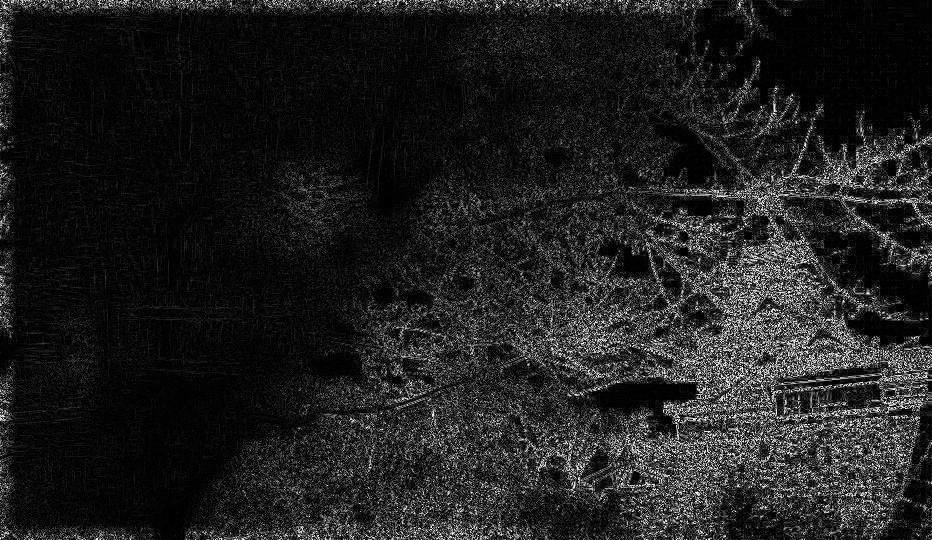

# HW2

Using ``python`` and ``Matlab`` to coding.

## [HW2.1 - Extended Depth of Field.](HW2.1.ipynb)

Two images:

* focus on background

* focus on foreground

### Method

1. Using **Laplacian Filter** to get the adumbration from images.

2. Make it to **Binary-Mask**.  

3. Clear image with binary-mask (Clear = fg + bg)

## [HW2.2 - Simulation of Disordered Vision](HW2.2.ipynb)

### Red-Green color blindness

1. RBG to LAB
2. a*=0
3. LAB to RGB

### Blue-Yellow color blindness

1. RBG to LAB
2. b*=0
3. LAB to RGB

### Glaucoma

1. create a gaussian-kernel with size of input images.
2. sigma of guassian should be bigger.
3. imgage = image(RGB) .* gaussian-kernel.

## [HW2.3 - Analysis Leaves by Hyperspace](HW2_3.m)

Using ``Matlab`` to analysis features of leaves.

* [Main.m](HW2_3.m)
* [leaveFeature.m](leaveFeature.m)
* [featureDistribution.m](featureDistribution.m)

### Steps

1. load 90 images
2. foreground mask
3. analysis

    * gradient of signature
    * mean brightness by gray
    * red ratio R/(R+G+B)
    * mean high frequency (Laplacian + abs + mean)

4. 1000*1000 white background
5. plot images to relative position by analysis

