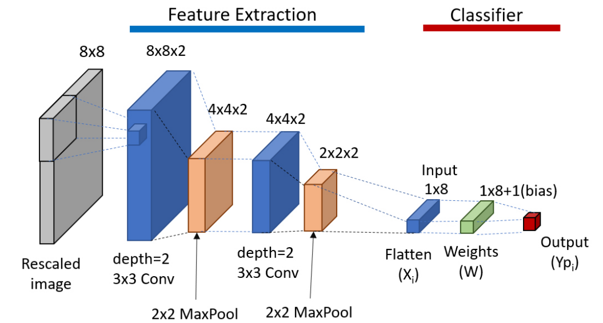
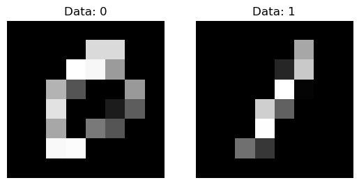
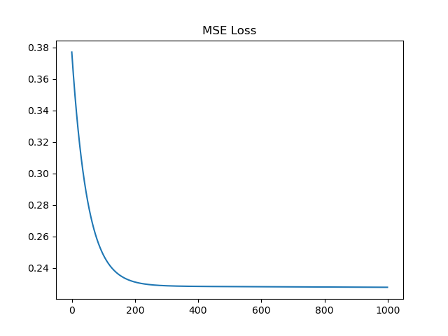
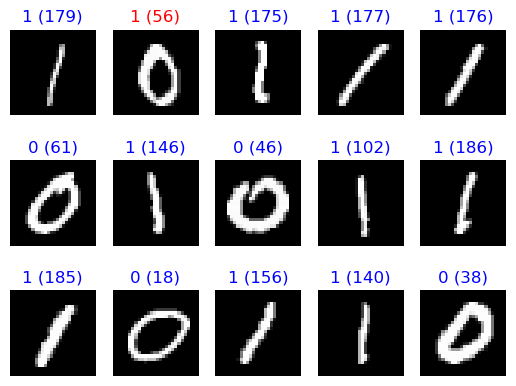

# HW3

Using ``python`` to coding

Python Library:

* os
* numpy
* cv2
* matplotlib
* random
* datetime

## Run

```bash
python HW3_linear_regression.py
# Input NUMBER1 (0~9): 
# Input NUMBER2 (0~9):

python HW3_gradient_descent.py
# Input NUMBER1 (0~9): 
# Input NUMBER2 (0~9):
```

## [HW3 - Image Recognition with Simplify CNN](HW3.ipynb)

[Dataset](https://mailntustedutw-my.sharepoint.com/:u:/g/personal/m11107309_ms_ntust_edu_tw/EfS2C1MOel5LpJ5J_ZUmngIBVGiOgaJuz0m4zxXDFwkSGw?e=IC6BPw): 1000 images(0~9)

Recognition with **linear regression** or **gradient descent**.

## Method



### Load the data

Input two NUMBER1 & NUMBER2 (0~9).

Read image_NUMBER1 and image_NUMBER2



### Create filter

Create two filters

$filter1=\begin{vmatrix}
-1  & -1 & 1   \\
-1  & 0  & 1   \\
-1  & 1  & 1   \\
\end{vmatrix}$

$filter2 = (filter1)^T$

### Feature extraction

```python
for i in range(200):

    # Leyer 1: Convolve2D
    conv1 = convolve2D(imgs[:,:,i],filter1)
    conv2 = convolve2D(imgs[:,:,i],filter2)
    # Leyer 1: Max pooling
    conv1 = max_pool(conv1)
    conv2= max_pool(conv2)
    featuremap = np.stack((conv1,conv2),axis=0)
    # Leyer 2: Convolve2D
    conv1 = convolve2D(featuremap[0],filter1)
    conv1 = convolve2D(conv1,filter2)
    conv2 = convolve2D(featuremap[1],filter1)
    conv2 = convolve2D(conv2,filter2)
    # Leyer 2: Max pooling
    conv1 = max_pool(conv1)
    conv2= max_pool(conv2)
    featuremap = np.stack((conv1,conv2),axis=0)
    # Flatten
    output[0:8,i] = featuremap.flatten()
    # Add bias
    output[8,i] = 1
```

### **Linear Regression**

$X(200\times9)$ : Feature

$Y(200\times1)$ : Target

$A(9\times1)$ : Optimal Coefficient

Let $Y=XA$

$A=(X^TX)^{-1}X^TY$

### **Gradient Desent**

Mean Square Error
$(MSE) = \frac{1}{m}\sum_{i=1}^m(Y_i-X_i \ast W)^2$

$G=-\frac{1}{m}\sum_{i=1}^m(Y_i-X_i \ast W)X_i$

$dW = {-lr \ast G}$

$W = W + dW$



## Result

Random Sample: 15 images

### Confuse matrix

$\begin{vmatrix}
89  & 5  \\
11  & 95  \\
\end{vmatrix}$

### Prediction


