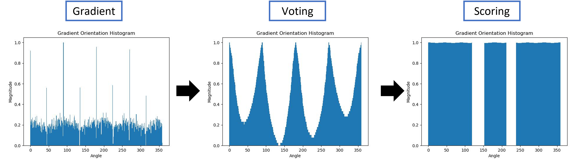

# HW4

Using ``python`` to coding.

## Run

First into your ``python-evn``, then run the code in terminal:

```bash
# run for one image
python main.py
# run for images (>1)
./test.bash
```

## [HW4 - Symmetry Axis Detection](main.ipynb)

參考課本 8.4，輸入一張有明顯對稱的灰階影像，輸出一張有對稱軸的影像(對稱軸以明顯顏色標出)。

### Flowchart


### Gradient

Using Sobel mask:

$G_x = \left[
    \begin{array}{ccc} 
    1&0&-1 \\
    2&0&-2 \\
    1&0&-1 
\end{array}\right ]$

$G_y = \left[
    \begin{array}{ccc} 
    1&2&1 \\
    0&0&0 \\
    -11&-2&-1 
\end{array}\right ]$

$\theta = \arctan{\frac{G_y}{G_x}}$

### Score

$S(x)= \sum_{\theta=0}^{359}{H(x+\theta)H(x-\theta)}$

## Result

Using a image with 8 different angele.


### Histogram


